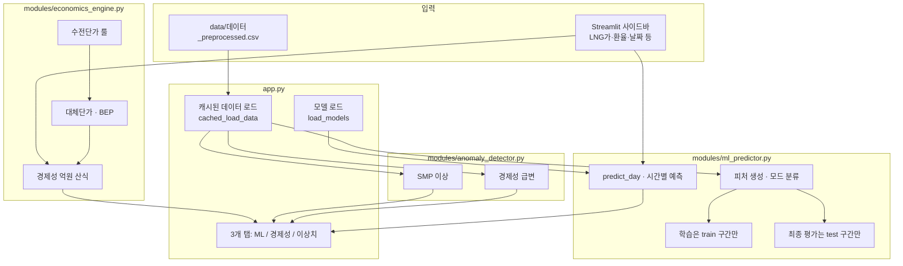

# LNG 발전 경제성 분석 대시보드 (LNG_pjt_01)

시간별 전력·LNG 데이터를 불러와 **머신러닝 예측**, **경제성(대체단가·BEP·억원) 계산**, **이상치 탐지**를 한 화면에서 보여주는 **Streamlit 웹 앱**입니다.

---

## 이 프로젝트로 할 수 있는 것

| 구분 | 설명 |
|------|------|
| **ML 예측** | 운전모드(1기 / 2기 저부하 / full부하)별로 역송량·수전량·효율을 예측 |
| **경제성 분석** | SMP·수전단가·대체단가·BEP·시간당 경제성(억원) 등을 표·차트로 확인 |
| **이상치 탐지** | SMP 이상(0·과대), 경제성 급변 구간을 기간별로 조회 |

---

## 폴더와 파일 구조 (무엇이 어디 있나)

```
project/
├── app.py                 # Streamlit 화면·탭·버튼 (실행 진입점)
├── config.py              # 데이터 경로, 운전모드 임계값, 수전단가 룰, ML 설정 등 상수
├── requirements.txt       # 필요한 Python 패키지 목록
├── README.md              # 이 문서
│
├── data/                  # 원본 `데이터.csv` → 전처리 `데이터_preprocessed.csv` (앱·학습은 후자, config.DATA_PATH)
│   ├── 데이터.csv         # 엑셀 등에서 내보낸 원본
│   └── 데이터_preprocessed.csv  # `python modules/preprocess_데이터.py` 결과 (학습·예측 기본 입력)
│
├── models/                # 학습된 XGBoost 모델(.pkl), metrics.pkl, impute_defaults.pkl
│
└── modules/               # 화면과 분리된 계산 로직
    ├── ml_predictor.py    # 데이터 로드, 피처, 학습/추론, train·test 분할
    ├── economics_engine.py # 수전단가, 대체단가, BEP, 경제성(억), 24시간 테이블
    └── anomaly_detector.py # SMP·경제성 이상치 탐지, Plotly 차트
```

- **`app.py`**만 실행하면 됩니다. 나머지는 `import`로 불러옵니다.
- **`config.py`**에서 **데이터 파일 이름**·**테스트 구간 비율** 등을 바꿀 수 있습니다.

---

## 동작에 필요한 환경

- **Python 3.10 이상** 권장  
- **운영체제**: Windows / macOS / Linux 모두 가능 (경로만 OS에 맞게 조정)

---

## 설치와 실행 (처음부터)

### 1) 저장소 받기

```bash
git clone https://github.com/hyojing8192-spec/LNG_pjt_01.git
cd LNG_pjt_01
```

### 2) 가상환경(선택)과 패키지 설치

```bash
python -m venv .venv
.venv\Scripts\activate          # Windows
# source .venv/bin/activate     # macOS / Linux

pip install -r requirements.txt
```

### 3) 데이터 파일 준비

- 원본 `data/데이터.csv`를 둔 뒤 `python modules/preprocess_데이터.py`로 `data/데이터_preprocessed.csv`를 만듭니다. (파일명을 바꾸면 `config.py`의 `DATA_PATH`도 같이 수정)
- CSV는 **시간 열(`구분` 또는 `datetime`)**과 **LNG발전량·SMP** 등이 포함된 형식이어야 합니다.

### 4) 앱 실행

```bash
streamlit run app.py
```

브라우저가 열리면 사이드바에서 **LNG 가격·환율·열량·분석 날짜**를 조정할 수 있습니다.

### 5) (선택) ML 재학습

- **ML 예측** 탭에서 **「모델 재학습」**을 누르면 `config.DATA_PATH`(기본 `data/데이터_preprocessed.csv`)를 읽어 `models/` 아래에 모델이 저장됩니다.
- 처음 실행 시 모델 파일이 없으면 자동으로 학습을 시도할 수 있습니다(시간이 걸릴 수 있음).

---

## 설정을 바꿀 때 (`config.py`)

| 항목 | 설명 |
|------|------|
| `DATA_PATH` | 읽을 CSV 경로 (기본: `data/데이터_preprocessed.csv`) |
| `MODE_THRESHOLDS` | LNG발전량(kW)으로 1기 / 2기 저부하 / full부하 구간을 나누는 값 |
| `ML_TEST_FRACTION` | 시계열 **뒤쪽 몇 %를 테스트 전용**으로 둘지 (기본 0.2 = 20%) |
| `ELEC_RATES`, `LEGAL_HOLIDAYS` | 수전단가·공휴일 룰 |

---

## 시스템 프로세스 아키텍처

아래는 **사용자가 앱을 켰을 때 데이터가 어떻게 흐르는지**를 단순화한 그림입니다.



### 한 줄 요약

1. **CSV** → 앱이 읽고 캐시합니다.  
2. **ML** 모듈이 **시계열 앞쪽(train)**으로만 학습하고, **뒤쪽(test)**은 점수 계산만 합니다.  
3. **경제성** 모듈이 룰 기반으로 대체단가·BEP·경제성(억)을 계산합니다.  
4. **이상치** 모듈이 SMP·경제성 급변을 표시합니다.  
5. 모든 결과가 **Streamlit 탭**에 모입니다.

---

## ML 데이터 분할 (초보자용 설명)

- 전체 CSV를 **시간 순서대로** 정렬한 뒤, **앞 80% ≈ train**, **마지막 20% ≈ test**로 나눕니다 (`ML_TEST_FRACTION=0.2`).
- **train**: 모델 학습·교차검증(CV)·튜닝에만 사용합니다.  
- **test**: 학습에 **절대 넣지 않고**, 학습이 끝난 모델로만 **MAE / R²**를 봅니다. (과적합 여부를 가늠할 때 참고)

화면의 **「R² (test)」** 등이 이 구간입니다.

---

## 자주 묻는 질문 (FAQ)

**Q. 데이터 파일을 `data_01.csv`로 바꾸고 싶어요.**  
→ `config.py`에서 `DATA_PATH`를 그 파일 경로로 수정한 뒤 앱을 다시 실행하세요.

**Q. API 키가 필요한가요?**  
→ 이 프로젝트의 **경제성·룰 계산**은 OpenAI 없이 동작합니다. ML은 **로컬 XGBoost**만 사용합니다.

**Q. `models` 폴더가 비어 있으면?**  
→ ML 탭에서 **재학습**을 실행하거나, 첫 로드 시 자동 학습이 돌아갈 수 있습니다.

**Q. GitHub에 올릴 때 빼야 할 것**  
→ `.gitignore`에 `__pycache__`, `.venv`, `.streamlit/secrets.toml` 등이 있습니다. 민감한 경로가 있으면 추가하세요.

---

## 라이선스·문의

- 교육·과제·내부 분석 용도로 사용하시면 됩니다.  
- 저장소: [https://github.com/hyojing8192-spec/LNG_pjt_01](https://github.com/hyojing8192-spec/LNG_pjt_01)

---

## 버전 정보

- **UI**: Streamlit  
- **ML**: XGBoost, scikit-learn  
- **차트**: Plotly  

`requirements.txt`에 호환 가능한 최소 버전이 명시되어 있습니다.
